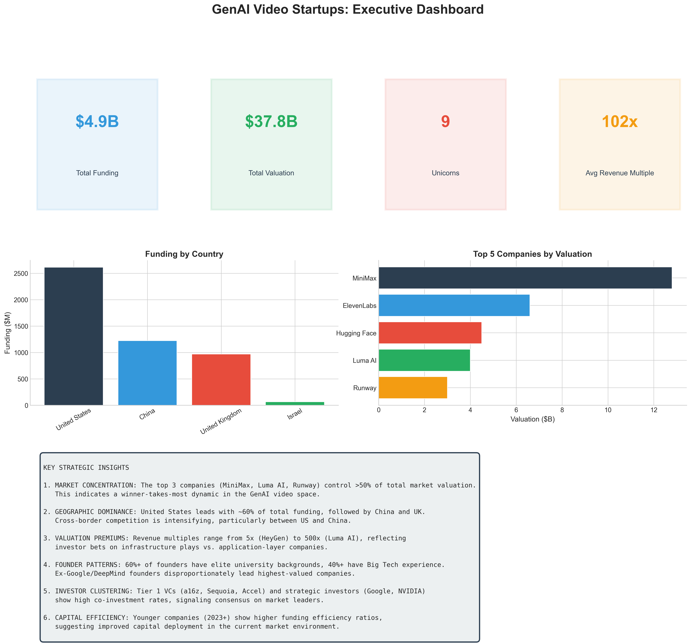

# GenAI Video Startups Data Analysis

Data analysis project exploring the GenAI video startup landscape, with a focus on funding trends, valuations, founders, investors, geographic patterns, and executive-style visual insights.

## Overview

This repository contains a notebook-driven market analysis of GenAI video startups using Python and Jupyter. The analysis combines structured research data with data wrangling, visualization, and summary reporting to highlight how the sector is evolving.

## Key Questions Answered

- Which companies have raised the most capital?
- How is funding distributed across startup stages?
- How do valuation and revenue multiples compare across companies?
- Which geographies are emerging as key hubs?
- Which investors appear most active in the market?
- What founder patterns and backgrounds stand out?

## Project Contents

- `GenAI_Video_Startups_Analysis.ipynb` — main analysis notebook
- `requirements.txt` — Python dependencies
- `ai_video_companies_research.json` — source research data
- `genai_video_companies_research.json` — source research data
- `analysis_companies.csv` — transformed company-level dataset
- `analysis_founders.csv` — founder-level dataset
- `analysis_investors.csv` — investor-level dataset
- `GenAI_Video_Startups_Funding_Analysis_20260125.xlsx` — spreadsheet output
- `GenAI_Video_Startups_Carousel.pdf` — presentation/report output
- `viz_*.png` — generated visualizations

## Analysis Areas

- Market overview and headline metrics
- Funding landscape and stage distribution
- Valuation and revenue multiple analysis
- Geographic distribution
- Investor network activity
- Founder profile patterns
- Competitive positioning and timeline analysis
- Executive summary and appendix tables

## Tools Used

- Python
- Jupyter Notebook
- pandas
- numpy
- matplotlib
- seaborn

## How to Run

1. Create and activate a Python virtual environment.
2. Install dependencies:

```bash
pip install -r requirements.txt
```

3. Launch Jupyter Notebook:

```bash
jupyter notebook
```

4. Open `GenAI_Video_Startups_Analysis.ipynb` and run the cells.

## Outputs

The notebook produces:

- cleaned analysis tables in CSV format
- presentation-ready charts in PNG format
- an Excel summary file
- a PDF carousel/report

## Preview



## Notes

- The analysis is notebook-based rather than packaged as standalone Python scripts.
- The local `venv/` environment is intentionally excluded from version control.
